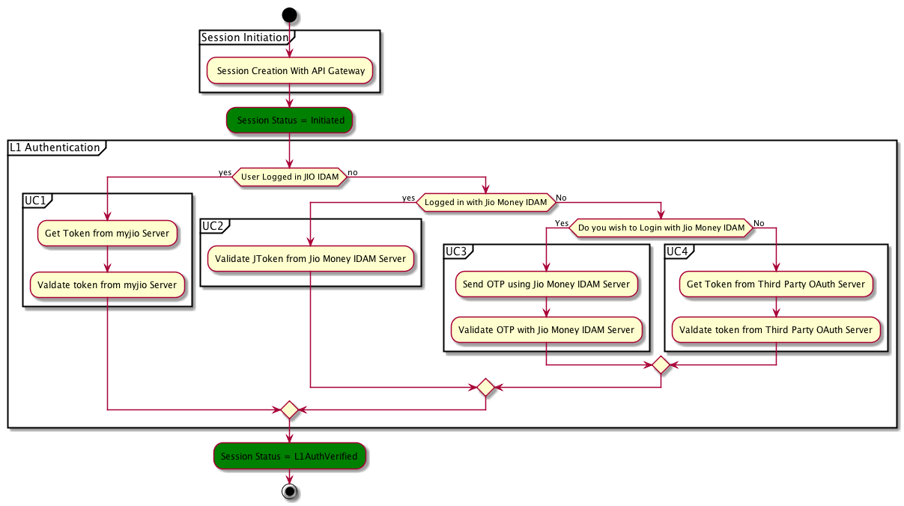
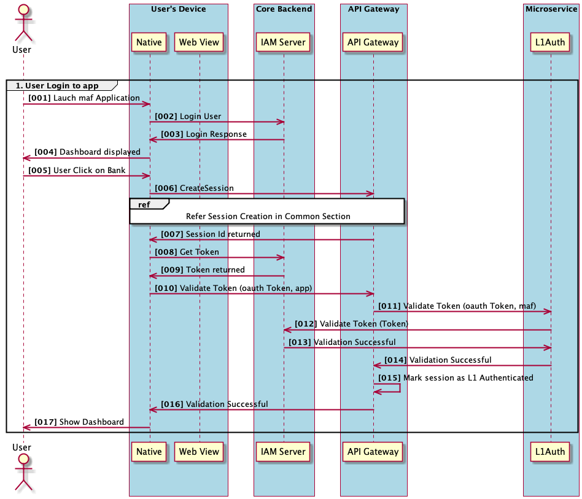

# Introdcution 
IAM is the centralized system managing the identity of Carrefour Customers and provides single identity / one time authentication of customer’s access to various channels such as mobile app and Self Care.

## State Diagram

## Usecases
### Login with Mobile OTP

Mobile-OTP is the primary way of logging into app. Once logged in, user can browse through the mini apps without entering OTP. OAuth token is generated and being passed to micro app’s after each toggle. It is micro app’s responsibility to validate OAuth token and allow access to the customer. Any invalid attempt should result in 401 unauthorized access. 
 

### Login using Social Login

## Interfaces 
### API to validate OAuth Token

Description: This is server to server API which will allow multiple microapps to validate OAuth token.

Method: Post

Endpoint: http://IP:PORT/ v1/jm/l1auth/validate/oauthtoken 

Request Headers:

Name |  Type |  Mandatory | Description |
------ | ------ | ------ | ------ 

 X-CHANNEL-ID|  String |  Yes|  Channel Name | 
 X-TRACE-ID|	String |No	| Shared by channel to maintain end to end tracing

5. [Interfaces](./Interfaces/index.md)
6. [Data Model](./DataModel/index.md)
7. [UseCases](./Usecases/index.md)
