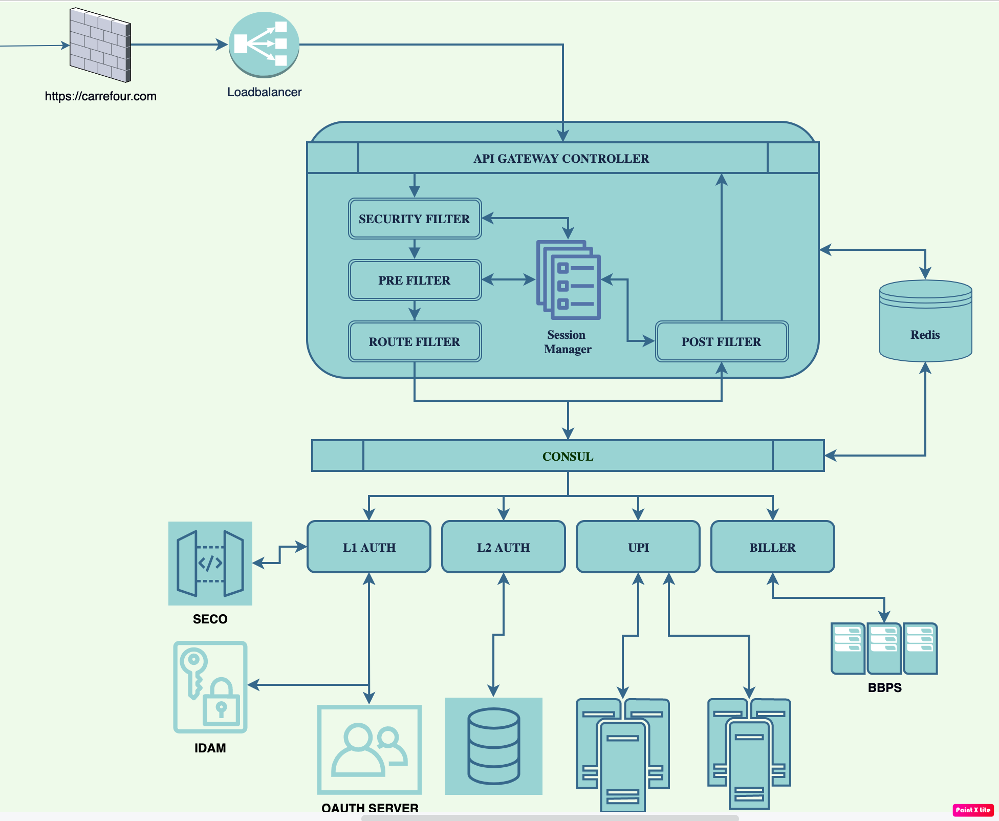
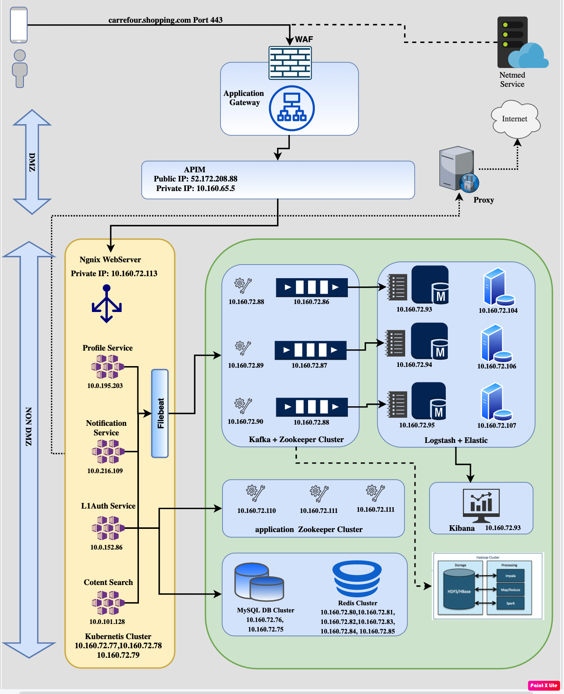

# Index

## Introduction 
This chapter identifies the document and the engagement to which it relates, describes the contents of the document, and states its purpose.
### pupose

The purpose of this document is to represent the integration architecture solution for the Carrefour Digital asset. This document is primarily used to:
•	Communicate to the sponsor and external stakeholders a conceptual understanding of the proposed integration solution.
•	Articulate how the illustrated integration solution aligns with program business objectives.
•	Identify the solution’s static structure, specifically – services exposed and realised within the institutional service layer, and the solution’s dynamic behaviour including system or people and their collaborations.
•	Outline integration guidelines, patterns and constraints for implementing the solution.
•	To identify any conflicts and issues with other component solution architectures, that may require remediation.
The architecture will evolve over time and it is intended that this document will be updated whenever significant decisions are made.

### Intended Audience of the document

The intended audience for this document includes (but not limited to) enterprise, solution and integration architects, solution engineers, test managers, test leads and project managers interested in understanding R4G Integration Architecture in order to use it as a part of integration layer for a given problem domain, and how this will enable a Services Oriented Architecture (SOA).
## Architecture Overview
This chapter provides a high level overview & description of the overall integration architecture and design approach being taken for the Use Case(s), typically a diagrammatic representation of the overall integration design being substantiated in detail by the subsequent sections.
### SystemContext diagram

### Key Concept

#### Actores

1. Content Manager
2. Customer care agent
3. Customers
4. Merchant Onboarding team
5. Prodcut Catalog Manager
6. Channel sales team

### Channels

1. Mobile application
2. Web Interface

### Integrations

1. [Entreprise service bus](./DesignApproach/index.md)
2. [Bussiness Process workflow](./DesignApproach/index.md)
3. [Microservices (Rest/Web ineterface)](./DesignApproach/index.md)

### Enterprise system layer

#### Catalog
#### Inventory

1. [SAP CRM](./DesignApproach/index.md)
2. [One Click](./DesignApproach/index.md)
3. [SAP HANA](./DesignApproach/index.md)
4. [MDM](./DesignApproach/index.md)
#### Fulfilment

1. [Order Management system](./DesignApproach/index.md)
2. [Last Mile](./DesignApproach/index.md)
3. [Notification system](./DesignApproach/index.md)

#### Billing & Payment

1. [Payment gateway integration](./DesignApproach/index.md)
2. [Loyality point integration](./DesignApproach/index.md)
3. [Accounting and reconcilliation](./DesignApproach/index.md)
4. [Partner settlement system](./DesignApproach/index.md)
5. [Fraud detection and Revention system](./DesignApproach/index.md)

#### Common

1. [Identity and access management](./idam/index.md)
2. [notification engine](./DesignApproach/index.md)
 
## Deployment diagram

5. [Interfaces](./Interfaces/index.md)
6. [Data Model](./DataModel/index.md)
7. [UseCases](./Usecases/index.md)
8. [Environmental Details](./env/index.md)